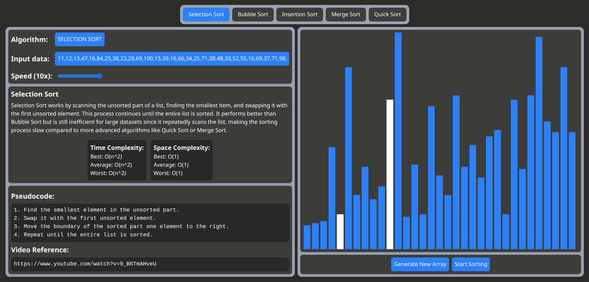
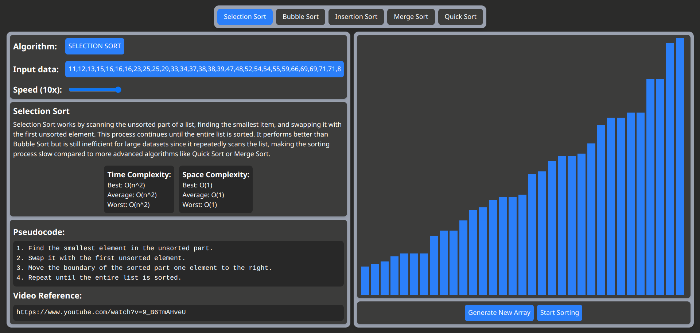

# DSA Visualizer

A **React-based Data Structures and Algorithms (DSA) Visualizer** that helps users understand sorting algorithms through animations. This project is interactive and visually represents how different sorting algorithms work step by step.

## 🚀 Features

-   📊 **Sorting Algorithms**: Bubble Sort, Selection Sort, Insertion Sort, Merge Sort, Quick Sort.
-   🎨 **Dynamic Visualizations**: Step-by-step animations to show the sorting process.
-   🎛 **User Control**: Adjust sorting speed and array size.
-   🔄 **Random Array Generator**: Generate new arrays for sorting.
-   📱 **Responsive UI**: Works across all screen sizes.

## 🖼 Demo

[Live Demo](https://algovisualizer-arbaz.netlify.app/)

## Project Screenshots

<div align="center">
    
    
</div>

## 🛠 Installation

To set up the project locally, follow these steps:

```bash
# Clone the repository
git clone https://github.com/ErArbazAnsari/AlgoVisualizer

# Navigate to the project directory
cd AlgoVisualizer

# Install dependencies
npm install

# Start the development server
npm run dev
```

## 📜 Available Sorting Algorithms

-   🔵 **Bubble Sort**
-   🟠 **Selection Sort**
-   🟢 **Insertion Sort**
-   🟡 **Merge Sort**
-   🔴 **Quick Sort**

## 🎨 How It Works

1. **Select an Algorithm**: Choose from available sorting algorithms.
2. **Adjust Speed**: Control the visualization speed.
3. **Generate New Array**: Create a randomized dataset.
4. **Start Sorting**: Watch the algorithm in action!

## 🛡 Tech Stack

-   ⚛ **React.js** – Frontend library
-   🎨 **CSS/Tailwind** – Styling
-   🏗 **JavaScript (ES6+)** – Logic & functionality

## 👨‍💻 Contributions

Contributions are welcome! Feel free to fork, create issues, and submit pull requests.

---

Made with ❤️ by [Arbaz Ansari](https://github.com/erarbazansari)

---
